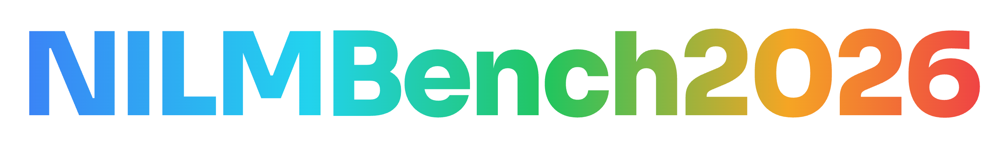
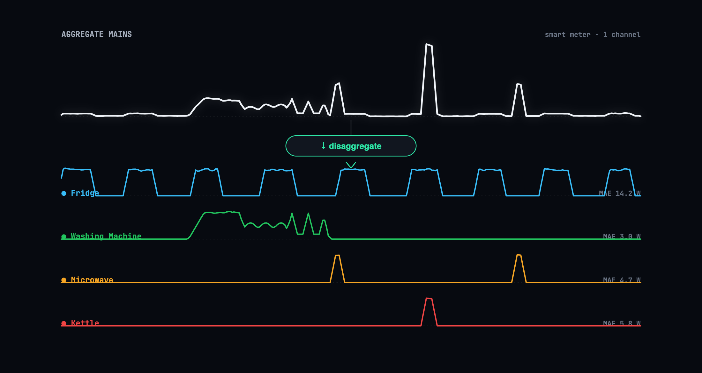
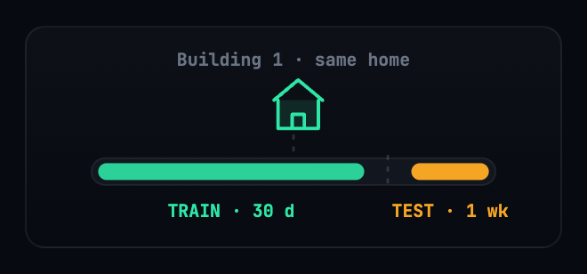
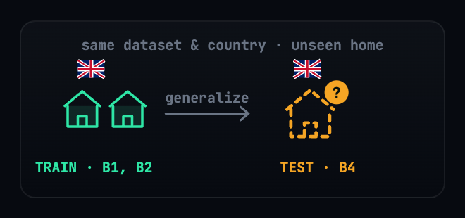
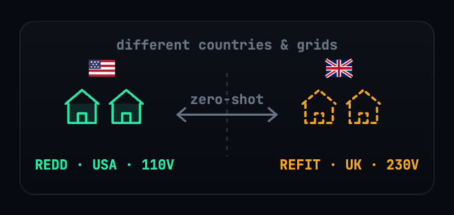
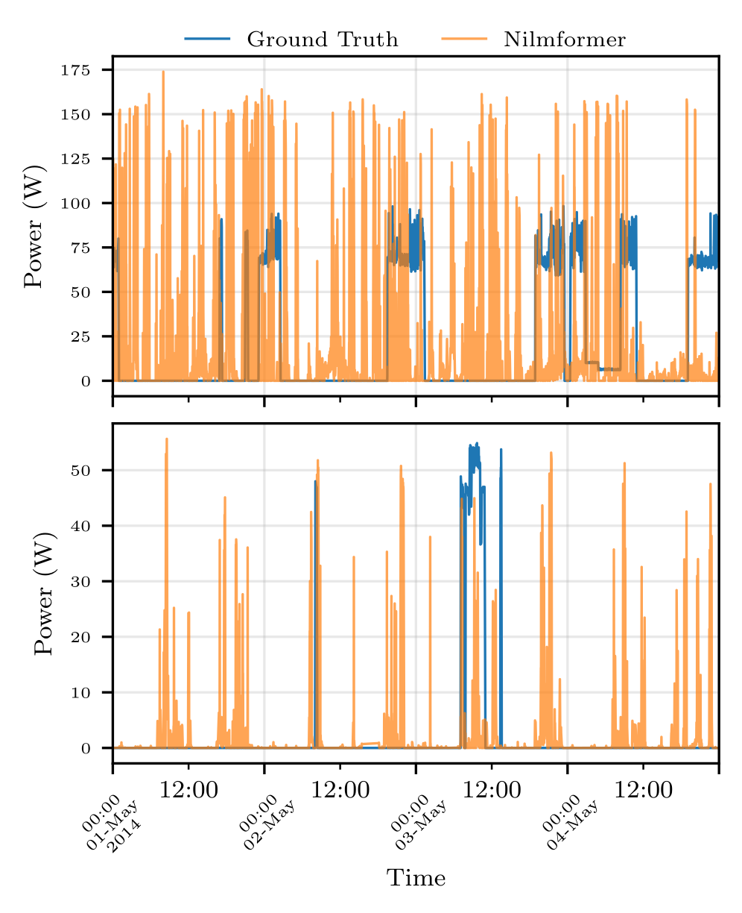
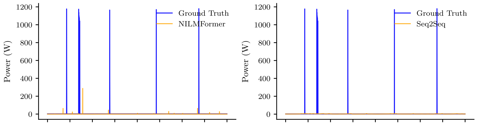

<style>
@import url('https://fonts.googleapis.com/css2?family=Sora:wght@600;700;800&family=Inter:wght@400;500;600;700&family=JetBrains+Mono:wght@400;500;600&display=swap');

:root{
  --bg:#070a10; --bg2:#0c1018; --card:#11161f;
  --tx:#eef2f7; --tx2:#a7b0be; --mut:#6a7484;
  --acc:#2ee6a6; --acc2:#38bdf8; --amber:#f5a524; --red:#ef4444; --green:#22c55e; --blue:#38bdf8;
  --bd:rgba(255,255,255,0.09);
  --spectrum:linear-gradient(110deg,#3b82f6,#22d3ee,#22c55e,#f5a524,#ef4444);
}

section{
  background:var(--bg); color:var(--tx);
  font-family:'Inter',-apple-system,sans-serif; font-size:25px; line-height:1.5;
  padding:62px 74px; letter-spacing:-0.01em;
}
section::before{ content:''; position:absolute; top:0; left:0; right:0; height:5px; background:var(--spectrum); }
section::after{ color:var(--mut); font-family:'JetBrains Mono',monospace; font-size:14px; right:30px; }
footer{ color:var(--mut); font-family:'JetBrains Mono',monospace; font-size:14px; opacity:.8; }

h1{ font-family:'Sora',sans-serif; font-weight:800; font-size:52px; line-height:1.06; letter-spacing:-0.03em; margin:0 0 16px; border:none; padding:0; }
h2{ font-family:'Sora',sans-serif; font-weight:700; font-size:40px; letter-spacing:-0.02em; margin:0 0 22px; padding-left:18px; border-left:5px solid var(--acc); }
h3{ font-family:'Sora',sans-serif; font-weight:700; font-size:25px; margin:0 0 6px; }
h4{ font-family:'JetBrains Mono',monospace; font-weight:600; font-size:15px; letter-spacing:.12em; text-transform:uppercase; color:var(--acc); margin:0 0 14px; }
strong{ color:#fff; font-weight:700; }
em{ color:var(--acc); font-style:normal; font-weight:600; }
a{ color:var(--acc); text-decoration:none; }

ul{ margin:6px 0; padding-left:0; list-style:none; }
li{ margin:13px 0; padding-left:30px; position:relative; color:var(--tx2); }
li strong{ color:var(--tx); }
li::before{ content:''; position:absolute; left:0; top:12px; width:9px; height:9px; border-radius:2px; background:var(--acc); }

code{ font-family:'JetBrains Mono',monospace; font-size:.82em; color:var(--acc); background:rgba(46,230,166,0.10); padding:2px 7px; border-radius:5px; }
pre{ background:#0a0e15; border:1px solid var(--bd); border-radius:12px; padding:20px 24px; font-size:18.5px; line-height:1.65; box-shadow:0 16px 40px rgba(0,0,0,.4); }
pre code{ background:none; color:#cdd6e4; padding:0; font-size:1em; }

table{ border-collapse:collapse; font-size:21px; width:100%; }
th{ background:rgba(46,230,166,0.07); color:var(--tx); font-family:'Sora',sans-serif; font-weight:600; padding:11px 16px; text-align:left; border-bottom:2px solid var(--acc); }
td{ padding:10px 16px; border-bottom:1px solid var(--bd); color:var(--tx2); font-variant-numeric:tabular-nums; }
tr:last-child td{ border-bottom:none; }
td strong{ color:var(--acc); }

img{ display:block; margin:0 auto; border-radius:12px; }

.cols{ display:flex; gap:26px; align-items:flex-start; }
.col{ flex:1; }
.vc{ display:flex; align-items:center; gap:30px; }
.card{ background:var(--card); border:1px solid var(--bd); border-radius:14px; padding:20px 22px; }
.card.acc{ border-left:4px solid var(--acc); }
.kpis{ display:flex; gap:18px; text-align:center; margin-top:8px; }
.kpi .n{ font-family:'Sora',sans-serif; font-weight:800; font-size:54px; line-height:1; background:linear-gradient(120deg,#2ee6a6,#38bdf8); -webkit-background-clip:text; -webkit-text-fill-color:transparent; }
.kpi .l{ color:var(--mut); font-size:16px; margin-top:6px; }
.muted{ color:var(--mut); font-size:18px; }
.big{ font-family:'Sora',sans-serif; font-weight:800; font-size:38px; color:var(--tx); letter-spacing:-0.02em; }
.tag{ display:inline-block; font-family:'JetBrains Mono',monospace; font-size:15px; font-weight:600; padding:5px 11px; border-radius:7px; margin:3px 2px; }
.tag.new{ background:var(--acc); color:#04140d; }
.tag.old{ background:rgba(255,255,255,0.05); color:var(--tx2); border:1px solid var(--bd); }
.lead-note{ color:var(--tx2); font-size:23px; }
.pill{ display:inline-block; font-family:'JetBrains Mono',monospace; font-size:15px; padding:5px 13px; border-radius:100px; border:1px solid var(--bd); color:var(--tx2); }

/* title slide */
section.title{ display:flex; flex-direction:column; justify-content:center; align-items:center; text-align:center; padding-top:40px; }
section.title h1{ font-size:104px; margin-bottom:6px; background:var(--spectrum); -webkit-background-clip:text; background-clip:text; -webkit-text-fill-color:transparent; letter-spacing:-0.04em; border:none; padding:0; }
section.title .sub{ font-family:'Sora',sans-serif; font-weight:600; font-size:32px; color:var(--tx); margin-bottom:30px; }
section.title .badges{ margin-bottom:34px; }
section.title .badges .b{ display:inline-block; font-family:'JetBrains Mono',monospace; font-size:16px; font-weight:600; padding:8px 18px; border-radius:100px; margin:0 6px; }
section.title .b.conf{ border:1px solid var(--bd); color:var(--tx2); }
section.title .b.award{ background:linear-gradient(120deg,#ffd55e,#f5a524); color:#1a1305; }
section.title .auth{ font-size:26px; color:var(--tx); margin-bottom:4px; }
section.title .auth .mk{ color:var(--acc); font-size:.7em; vertical-align:super; }
section.title .aff{ color:var(--mut); font-size:20px; margin-bottom:28px; }
section.title .links{ font-family:'JetBrains Mono',monospace; font-size:18px; color:var(--acc); }

/* section divider */
section.sec{ display:flex; flex-direction:column; justify-content:center; }
section.sec h4{ font-size:17px; }
section.sec h1{ font-size:64px; border:none; padding:0; max-width:90%; }
section.sec .big{ font-size:30px; color:var(--tx2); font-family:'Inter'; font-weight:400; margin-top:14px; max-width:80%; }

/* finding accent number */
.fnum{ font-family:'Sora',sans-serif; font-weight:800; font-size:30px; color:var(--acc); }
</style>

<!-- _class: title -->
<!-- _paginate: false -->
<!-- _footer: '' -->




<div class="sub">A Benchmark for Energy Disaggregation</div>

<div class="badges">
<span class="b conf">● BuildSys ’26 · Banff, Canada</span>
<span class="b award">★ Best Paper Candidate</span>
</div>

<div class="auth">Aayush Kuloor<span class="mk">*</span> &nbsp; Anurag Singh<span class="mk">*</span> &nbsp; Harsh Dhru<span class="mk">*</span> &nbsp; Nipun Batra<span class="mk">†</span></div>
<div class="aff">IIT Gandhinagar &nbsp;·&nbsp; * equal contribution &nbsp; † corresponding author</div>

<div class="links">github.com/sustainability-lab/nilmbench&nbsp;&nbsp;·&nbsp;&nbsp;sustainability-lab.github.io/nilmbench</div>

---

## What is energy disaggregation?

<div class="lead-note">One aggregate household power signal in &nbsp;→&nbsp; appliance-level estimates out. Fine-grained feedback can cut consumption by up to <strong style="color:var(--acc)">15%</strong>.</div>



$$ y_t = \textstyle\sum_{i=1}^{N} x_{i,t} + \epsilon_t \qquad\text{\small(aggregate = sum of appliances + noise \& unmetered loads)} $$

---

<!-- _class: sec -->

#### The problem

# Lots of models. No reproducible yardstick.

<div class="big">Architectures keep improving — but we can't fairly compare them, and we don't know if they'll <em>survive deployment</em>.</div>

---

## What prior benchmarks miss

<div class="cols">
<div class="col">

- **Efficiency ignored** — accuracy reported, but not FLOPs, parameters, or inference time
- **One resolution** — usually 1-min only; ignores utility-scale 15-min
- **Generalization untested** — rarely evaluated across buildings or datasets
- **Fragmented code** — Python 2.7, TensorFlow 1.x; gains conflated with implementation luck

</div>
<div class="col">

| Feature | '14 | '19 | **Ours** |
|---|:--:|:--:|:--:|
| Deployability | ✗ | ✗ | **uv+Docker** |
| Models | 2 | 9 | **16** |
| Resolutions | var | 1m | **1m & 15m** |
| Efficiency | ✗ | ✗ | **✓** |
| Cross-building | ✗ | ✓ | ✓ |
| Cross-dataset | ✗ | ✗ | **✓** |
| Stack | Py2.7 | TF1 | **PyTorch** |

</div>
</div>

---

## NILMBench2026

<div class="kpis">
<div class="kpi"><div class="n">16</div><div class="l">models</div></div>
<div class="kpi"><div class="n">3</div><div class="l">datasets</div></div>
<div class="kpi"><div class="n">2</div><div class="l">resolutions</div></div>
<div class="kpi"><div class="n">3</div><div class="l">tasks</div></div>
<div class="kpi"><div class="n">576</div><div class="l">configs ×3 runs</div></div>
</div>

<br>

- A **reproducible, deployment-aware** benchmark across accuracy, efficiency & generalization
- We **modernize NILMTK**: every legacy model re-implemented in **PyTorch** under one API
- One-command reproducibility with **`uv`** + **Docker**, and **+5** modern architectures

---

## Reproduce every result in 3 commands

```bash
# install the modernized stack — 16 models, one PyTorch API
uv pip install "nilmtk-contrib[torch] @ git+https://github.com/sustainability-lab/nilmbench.git"
# …or a pinned, GPU-ready container
docker run --gpus all ghcr.io/sustainability-lab/nilmtk-contrib:latest bash
```

```python
from nilmtk.api import API
from nilmtk_contrib.torch import NILMFormer, Seq2PointTorch, TCN

experiment['methods'] = {'NILMFormer': NILMFormer({'n_epochs': 50}), ...}
results = API(experiment)     # trains, tests & scores every model
```

<div class="muted">Adding a model = subclass <code>Disaggregator</code>. Adding a metric = one function. Same harness for everyone.</div>

---

## Datasets — two countries, two grids

| Dataset | Country | Buildings | Duration | Appliances |
|---|---|:--:|:--:|:--:|
| **REDD** | 🇺🇸 USA (110 V) | 6 | 3–19 days | 10–20 |
| **UK-DALE** | 🇬🇧 UK (230 V) | 5 | 655 days | 5–54 |
| **REFIT** | 🇬🇧 UK (230 V) | 20 | 2 years | 9–21 |

<div class="muted" style="margin-top:18px">Six appliances spanning NILM difficulty: <span class="pill">Fridge</span> <span class="pill">Microwave</span> <span class="pill">Kettle</span> <span class="pill">Washing Machine</span> <span class="pill">Dish Washer</span> <span class="pill">Television</span> &nbsp;·&nbsp; excluded: single-building (AMPds, iAWE…) & pay-walled (PecanStreet)</div>

---

## 16 architectures, 4 families

<div class="cols">
<div class="col">

#### Recurrent & Hybrid
<span class="tag old">RNN</span><span class="tag old">WindowGRU</span><span class="tag new">ConvLSTM</span><span class="tag old">RNN-Attn</span><span class="tag old">RNN-Attn-Cl</span>

#### Fully Convolutional
<span class="tag old">Seq2Point</span><span class="tag old">Seq2Seq</span><span class="tag new">TCN</span><span class="tag old">ResNet</span><span class="tag old">ResNet-Cl</span>

</div>
<div class="col">

#### Transformer-Based
<span class="tag old">BERT</span><span class="tag new">Reformer</span><span class="tag new">NILMFormer</span>

#### Specialized NILM
<span class="tag old">DAE</span><span class="tag new">MSDC</span>

</div>
</div>

<br>

<div class="muted"><span class="tag new" style="font-size:13px">green</span> = the <strong style="color:var(--acc)">5 architectures we add</strong> in NILMBench2026 (TCN, ConvLSTM, MSDC, Reformer, NILMFormer)</div>

---

## Three tasks — increasing realism

<div class="cols">
<div class="col">

<h3>T1 · Intra-Building</h3>
<div class="muted">Same home, train past → test held-out week. Best case.</div>
</div>
<div class="col">

<h3>T2 · Cross-Building</h3>
<div class="muted">Unseen home, <strong>same country</strong>. The realistic test.</div>
</div>
<div class="col">

<h3>T3 · Cross-Dataset</h3>
<div class="muted">Zero-shot, <strong>different country & grid</strong>. Hardest.</div>
</div>
</div>

---

<!-- _class: sec -->

#### Finding 1

# No single model wins.

<div class="big">Performance is highly <em>context-dependent</em> — the best architecture changes with appliance type and time resolution.</div>

<br>

- **1-min:** deep CNNs (Seq2Point, TCN) capture sharp activation transients
- **15-min:** averaging erases detail — NILMFormer's attention & exogenous priors win
- CNNs excel at sparse bursts; Transformers handle complex multi-state loads

---

## Finding 2 — generalization is the wall

<div class="vc">
<div style="flex:1.05">

- Accuracy **collapses** from T1 → T2 → T3, symmetrically in both transfer directions
- Models memorize **one device's electrical fingerprint** — not the abstract appliance
- Right: NILMFormer on a TV — tracks the *trained* set (bottom), **fails** on an unseen TV (top)

<div class="card acc" style="margin-top:14px">The drop from same-building to unseen-building is the <strong>core barrier to real-world NILM</strong>.</div>

</div>
<div style="flex:.95">

</div>
</div>

---

## Finding 3 — MAE is misleading

<div class="lead-note">On sparse loads, a model scores a low MAE by always predicting <em>“off”</em> — while missing <strong>every</strong> activation.</div>



<div class="muted">REFIT microwave (cross-building): four models miss every 1200 W spike, yet look “accurate” by MAE. <strong>Event metrics (F1) are essential.</strong></div>

---

## Finding 4 — efficiency ≠ accuracy

<div class="cols">
<div class="col">

The accuracy–compute trade-off is **non-monotonic**. Architectural inductive bias beats raw compute.

- **TCN** — just **69K params** — rivals the heavyweight NILMFormer on cross-dataset tasks
- Smallest models consistently *under*-perform; biggest aren't the best
- Real deployment likely needs an **ensemble** of specialists

</div>
<div class="col">

| Model | MAE↓ | GFLOPs | Params |
|---|:--:|:--:|:--:|
| NILMFormer | **15.4** | 135 | 383K |
| Seq2Point | 18.4 | 72 | 3.6M |
| **TCN** | 20.8 | **20** | **69K** |
| BERT | 23.7 | **5.4** | 803K |

<div class="muted">T2 cross-building (UK-DALE), mean MAE.</div>

</div>
</div>

---

## Four takeaways

<div class="cols">
<div class="col">
<div class="card" style="margin-bottom:18px"><h3>🏆 No single model wins</h3><div class="muted">Best architecture depends on the appliance signature — CNNs for bursts, Transformers for multi-state.</div></div>
<div class="card"><h3>🎭 MAE is misleading</h3><div class="muted">Predicting “off” hides missed events. Report F1 for sparse loads.</div></div>
</div>
<div class="col">
<div class="card" style="margin-bottom:18px"><h3>🧱 Generalization is the hurdle</h3><div class="muted">Models fail on unseen buildings & datasets — the barrier to adoption.</div></div>
<div class="card"><h3>⚖️ Efficiency ≠ accuracy</h3><div class="muted">Non-monotonic: a 69K-param TCN rivals heavyweights.</div></div>
</div>
</div>

---

<!-- _class: sec -->

#### A living benchmark

# Built to become NILM’s ImageNet.

<div class="big">ImageNet moved vision. GLUE moved language. NILM has never had a shared, sealed, <em>generalization-first</em> leaderboard — until now.</div>

<br>

- **Add a model** in one class · **add a metric** in one function · same frozen harness
- Submit to a public, OOD-first **leaderboard** — currently led by NILMFormer (T2 MAE 15.4)
- Toward an annual **NILM Challenge** in the spirit of the KDD Cup

---

## Conclusion

<div class="lead-note">NILMBench2026 evaluates <strong>16 models × 3 datasets × 2 resolutions</strong> on accuracy, efficiency & generalization — and ships the reproducible platform to keep doing so.</div>

<br>

- **Generalization is the prerequisite** for deploying NILM at scale — not marginal accuracy
- No universal model; MAE misleads on sparse loads; efficiency is decoupled from accuracy
- **Next:** domain adaptation · self-supervised pre-training · adaptive denormalization · community leaderboards

---

<!-- _class: title -->
<!-- _paginate: false -->


<div class="sub">Generalization is the wall. Let’s tear it down — together.</div>

<div class="auth" style="margin-top:10px">Aayush Kuloor · Anurag Singh · Harsh Dhru · Nipun Batra</div>
<div class="aff">nipun.batra@iitgn.ac.in &nbsp;·&nbsp; IIT Gandhinagar</div>

<div class="links" style="margin-top:24px">
📄 sustainability-lab.github.io/nilmbench<br>
💻 github.com/sustainability-lab/nilmbench
</div>
